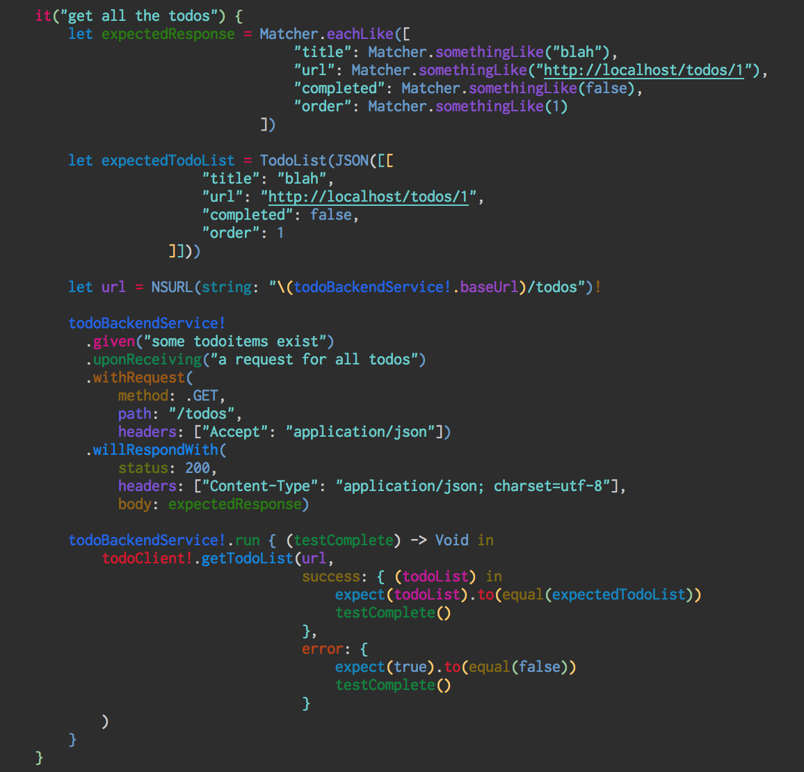
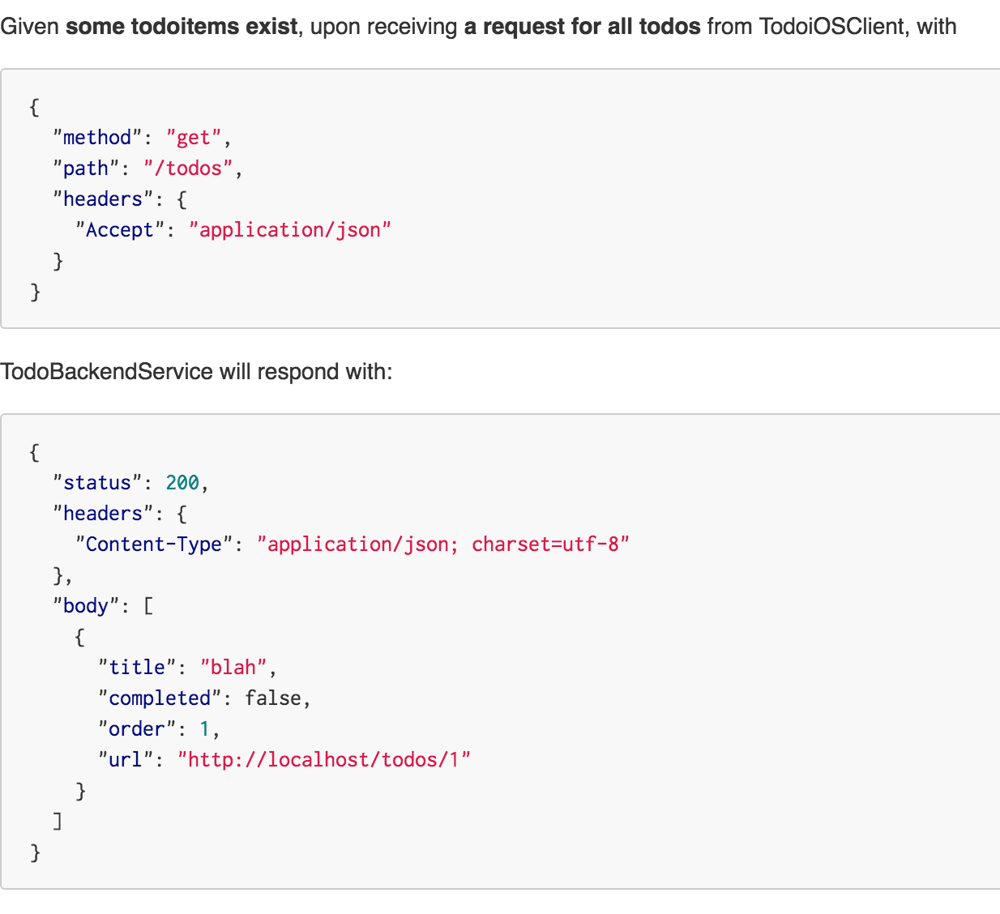
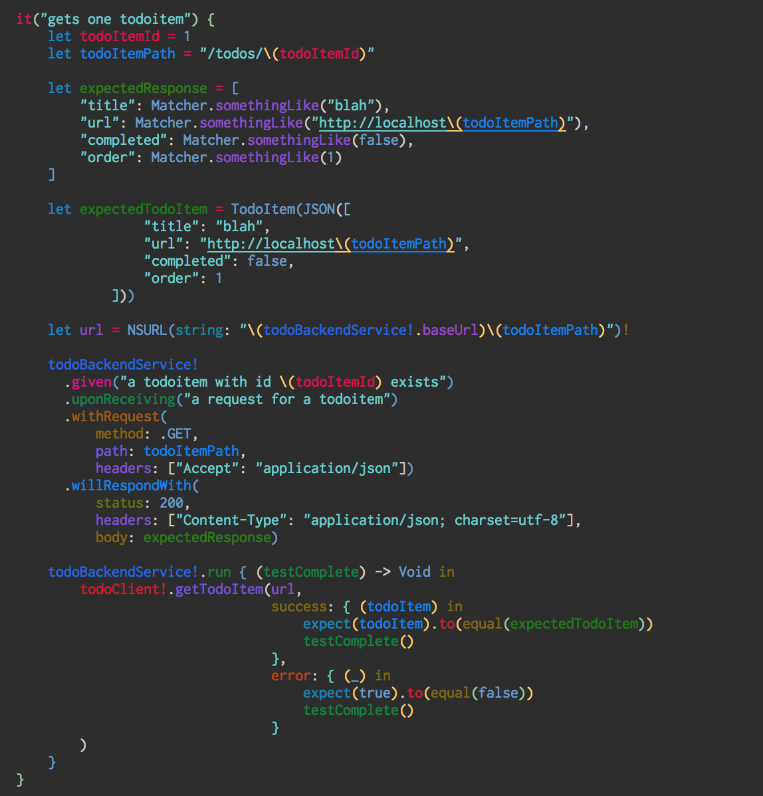
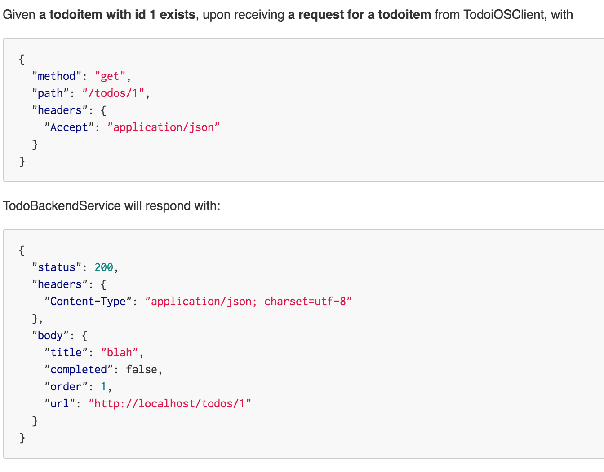
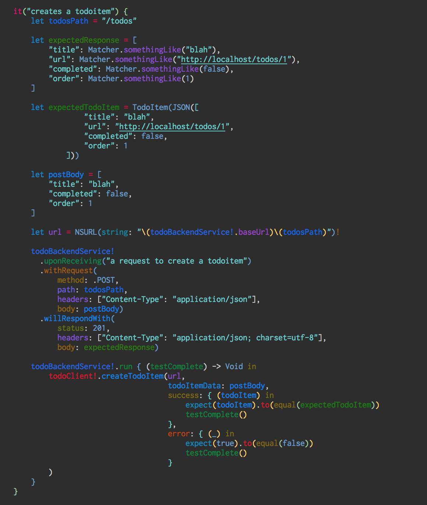
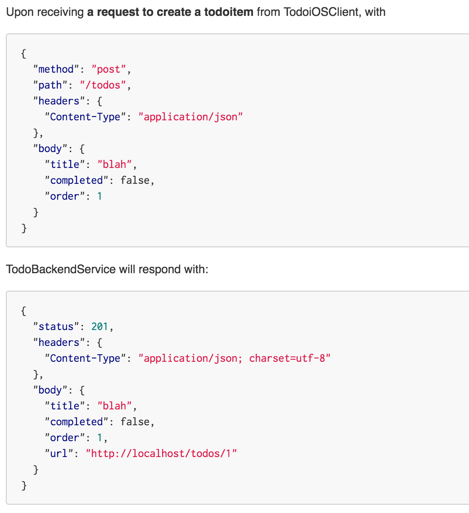
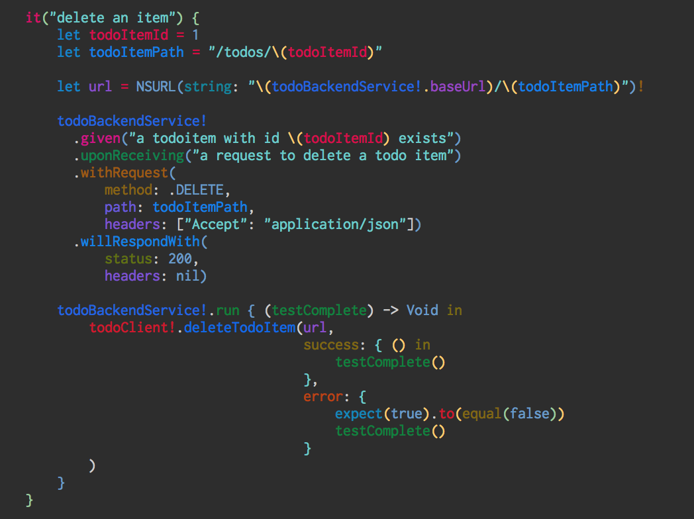
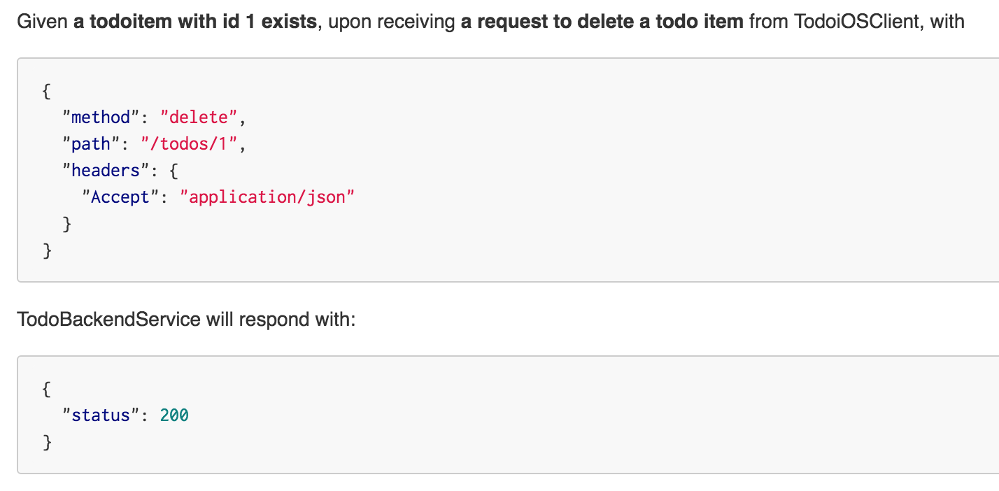

iOS, Docker and Consumer Driven Contract Testing with Pact
-------

Over the past few weeks, I worked on an iOS Application which used a swarm of MicroServices developed in multiple languages with the only commonality being they all run in the cloud in Docker Containers.
This post is inspired off some of the efforts to write consumer driven contract tests for the iOS Application which use Services exposing a HTTP+JSON API.

Example source code for the iOS Project can be found [here](https://github.com/rajatvig/pact-demo-client). The code is intended as a demo and guide for developers working on iOS Applications and struggling with similar concerns.

The primary intent of this post is to help show how to write contract tests, not build an iOS Application. The [code](https://github.com/rajatvig/pact-demo-client) at Github is akin to a Client SDK that communicates with the backend service. As it stands, the demo project can be used by CocoaPods or Carthage when making the iOS Application.

## What is Consumer Driven Contract Testing

At the most basic level, the *Consumer* runs a suite of *integration* tests against a *Provider* of services. The end result of the suite is a *contract* that the *provider* can then use to verify that it obeys the expected *contract* as expected by the *consumer*.
The [Pact](https://docs.pact.io/) Website does a great job explaining Consumer Driven Contract Testing, recommend very strongly reading those. Here's links to the [Wiki](https://github.com/realestate-com-au/pact/wiki), [FAQ](https://docs.pact.io/faq/) and even more [documentation](https://docs.pact.io/).
There are more articles that explain the nuances in further detail. [1](http://martinfowler.com/articles/consumerDrivenContracts.html), [2](https://docs.pact.io/faq/convinceme.html).

## Why Pact

There are other tools that work equally well, notably [Pacto](https://github.com/thoughtworks/pacto), [Mountebank](http://www.mbtest.org/). [Pact](https://github.com/realestate-com-au/pact) has a *consumer* implementation in [Swift](https://github.com/DiUS/pact-consumer-swift) which makes it a lot more suitable for iOS Applications. There also exists a Docker Image to help verify *contracts* on the *provider* end using proxies.

## Tools required

0. Xcode

1. Docker

    > Docker Images avoid the direct dependency on Ruby and RubyGems used by almost all Pact based tools, thus limiting them to just Docker.
Using Docker Compose allows us to have commands run list on the Docker Images while providing the relevant runtime environment variables and disk volumes in a more structured manner.

    To install Docker

    ```bash
    brew cask install docker
    ```

2. Make

    > `make` is ubiquitous, is readable when used correctly, has task dependencies and simplifies tasks CI/CD environments which traditionally have been done inside opaque, long winding shell scripts. It should already be installed if you've Xcode.

3. [Carthage](https://github.com/Carthage/Carthage)
    > Carthage is a simpler package manager over CocoaPods.

    To install Carthage

    ```bash
    brew install carthage
    ```

4. [Swiftlint](https://github.com/realm/SwiftLint)
    > Swiftlint is a nice, quick easy linter for Swift code.

    To install Swiftlint

    ```bash
    brew install swiftlint
    ```

## Running the Demo

1. Install the required RubyGems - Fastlane, Xcov, Scan
>
```bash
make install
```

2. Run all the Unit Tests
>
```bash
make test
```

3. Run all the Contract Tests
>
```bash
make contract_tests
```

4. Publish and Verify Contracts with the Provider
>
```bash
make pact_publish pact_verify
```
>
This will fetch the Docker Image for the [Pact Broker](https://hub.docker.com/r/rajatvig/pactbroker/), [Pact Verifier](https://hub.docker.com/r/dius/pact-provider-verifier-docker/), [Pact Publisher](https://hub.docker.com/r/rajatvig/pactbroker-client/) and the [Provider](https://hub.docker.com/r/rajatvig/todobackendservice/). Additionally, images for Postgres (used by Pact Broker) and Redis (used by Provider) will be fetched and run.

5. Clean up
>
```bash
make clean
```

## About the Provider used

The provider is akin to the many [Todo Backend](http://todobackend.com/) Services provided in multiple languages using different storage providers and frameworks to implement a HTTP+JSON API to manage Todos. I'm using a [fork](https://github.com/rajatvig/todo-backend-node-koa-redis) of a JavaScript backend which uses [Koa and Redis](https://github.com/selvakn/todo-backend-node-koa-redis). Feel free to use another but you will have to add support for [Provider States](https://github.com/realestate-com-au/pact/wiki/Provider-states) as expected by the iOS Client.

The specific bit of the contract we are interested in is as follows

1. Get a list of Todo Items at `/todos`
2. Get a specific Todo Item at `/todos/:id`
3. Create a Todo Item at `/todos`
4. Deletes a specific Todo Item at `/todos/:id`

A JSON representation of the TodoItem is

```json
{
  "title": "blah",
  "completed": false,
  "order": 1,
  "url": "http://localhost/todos/1"
}
```

The [Todo Backend](http://todobackend.com/) project documents a lot more endpoints but this is a good enough subset to get going.

## Consumer code walkthrough

The model structs use [SwiftyJSON](https://github.com/SwiftyJSON/SwiftyJSON) to parse the JSON to Swift. The client uses [Alamofire](https://github.com/Alamofire/Alamofire) to make the HTTP calls and uses the Model classes to parse the JSON to Swift types.

### Primary Classes

#### [Sources/Models/TodoItem.swift](https://github.com/rajatvig/pact-demo-client/blob/master/Sources/Models/TodoItem.swift)

>```swift
>public struct TodoItem: CustomStringConvertible, Equatable {
>    public let title: String
>    public let completed: Bool
>    public let order: Int?
>    public let url: NSURL?
>
>    public init(_ jsonData: JSON) {
>        self.title = jsonData["title"].stringValue
>        self.completed = jsonData["completed"].boolValue
>        self.order = jsonData["order"].int
>        self.url = NSURL.init(string: jsonData["url"].stringValue)
>    }
>...
>```

#### [Sources/Models/TodoList.swift](https://github.com/rajatvig/pact-demo-client/blob/master/Sources/Models/TodoList.swift)

>```swift
>public struct TodoList: CustomStringConvertible, Equatable {
>    public let todoItems: [TodoItem]
>
>    public init(_ jsonData: JSON) {
>        self.todoItems = jsonData.arrayValue.map { return TodoItem($0) }
>    }
>...
>```

#### [Sources/TodoClient.swift](https://github.com/rajatvig/pact-demo-client/blob/master/Sources/TodoClient.swift)

>```swift
>public class TodoClient {
>    public func getTodoList(url: NSURL, success: (TodoList) -> Void, error: () -> Void) -> Void {
> ...
>    public func getTodoItem(todoItemUrl: NSURL, success: (TodoItem) -> Void, error: () -> Void) -> Void {
> ...
>    public func deleteTodoItem(todoItemUrl: NSURL, success: () -> Void, error: () -> Void) -> Void {
        let headers = [
            "Accept": "application/json"
        ]
>
        Alamofire.request(.DELETE, todoItemUrl, headers: headers)
          .validate()
          .response { request, response, data, reqerror in
                      guard reqerror == nil else {
                          print("error while deleting product: \(reqerror)")
                          error()
                          return
                      }
>
                      success()
        }
> ...
>```

### Targets
Schemes are available to run,

0. [TodoClient](https://github.com/rajatvig/pact-demo-client/blob/master/TodoClient.xcodeproj/xcshareddata/xcschemes/TodoClient.xcscheme) which builds the TodoClient.framework.

1. [TodoClientUnitTests](https://github.com/rajatvig/pact-demo-client/blob/master/TodoClient.xcodeproj/xcshareddata/xcschemes/TodoClientUnitTests.xcscheme) which runs all the Unit Tests using [Quick](https://github.com/Quick/Quick), [Nimble](https://github.com/Quick/Nimble) and [OHHTTPStubs](https://github.com/AliSoftware/OHHTTPStubs).

2. [TodoClientContractTests](https://github.com/rajatvig/pact-demo-client/blob/master/TodoClient.xcodeproj/xcshareddata/xcschemes/TodoClientContractTests.xcscheme) which runs all the contract tests using [Quick](https://github.com/Quick/Quick), [Nimble](https://github.com/Quick/Nimble) and [Pact Consumer Swift](https://github.com/DiUS/pact-consumer-swift)

## Creating the Contract Tests

Basic structure of the contract tests is simple.

1. Give the provide a state - .given("some state")

2. Defined the expectation - .uponReceiving("a request")

3. Specify the exact Request - .withRequest(method: , path:, headers:, body: )

4. Specify the expected Response - .willRespondWith(status: , headers:, body: )

The response body can use constructs like

1. Matcher.eachLike - an array with at least element matching the given structure. The example value is what the Test will get.
2. Matcher.somethingLike - match the data type of the example value. The example value is what the Test will get.

### [Tests/TodoClientContractSpec.swift](https://github.com/rajatvig/pact-demo-client/blob/master/Tests/TodoClientContractSpec.swift)

### Global Setup
```swift
var todoBackendService: MockService?
var todoClient: TodoClient?

beforeEach {
    todoBackendService = MockService(
            provider: "TodoBackendService",
            consumer: "TodoiOSClient"
    )

    todoClient = TodoClient()
}
```

### Contract for Get all Todo Items
[](https://github.com/rajatvig/pact-demo-client/blob/master/Tests/TodoClientContractSpec.swift#L22)


### Contract for Get a Todo Item
[](https://github.com/rajatvig/pact-demo-client/blob/master/Tests/TodoClientContractSpec.swift#L117)


### Contract for Create a Todo Item
[](https://github.com/rajatvig/pact-demo-client/blob/master/Tests/TodoClientContractSpec.swift#L65)


### Contract for Delete a Todo Item
[](https://github.com/rajatvig/pact-demo-client/blob/master/Tests/TodoClientContractSpec.swift#L163)


## Generating the Contract

The scheme for `TodoClientContractTests` uses Docker Compose to run the Pact Mock Service. At the end of the Tests run, the generated contract is stored in the Pacts directory as declared in the compose file.

```yaml
version: '2'
volumes:
  pacts:
services:
  pactservice:
    image: rajatvig/pactservice:0.1.1
    volumes:
      - ./Pacts:/pacts
    ports:
      - "1234:80"
```

Running

```bash
make contract_tests
```

should run all the contract tests and when succesful drop the contracts to the Pacts folder.

## Publishing the Contract
[Pact Broker](https://github.com/bethesque/pact_broker) is a nice service to store generated contracts with pretty user facing documentation.

### Compose configuration for running the Pact Broker

```yaml
version: '2'
volumes:
  brokerdata:
services:
  pact_broker:
    image: rajatvig/pactbroker:0.1.3
    hostname: broker
    domainname: docker.local
    environment:
      PACT_BROKER_DATABASE_USERNAME: pactbroker
      PACT_BROKER_DATABASE_PASSWORD: password
      PACT_BROKER_DATABASE_HOST: brokerdb.docker.local
      PACT_BROKER_DATABASE_NAME: pactbroker
    ports:
      - "80:80"
    depends_on:
      - pact_broker_db
    links:
      - pact_broker_db:brokerdb.docker.local
  pact_broker_db:
    image: postgres
    hostname: brokerdb
    domainname: docker.local
    environment:
      POSTGRES_PASSWORD: password
      POSTGRES_USER: pactbroker
      POSTGRES_DB: pactbroker
    volumes:
      - brokerdata:/var/lib/postgresql/data
    ports:
      - "5432:5432"
```

> Running this via Docker Compose will start the Pact Broker at port 80 and a Postgres at port 5432. 

## Publishing the Contract
The contract when created needs to be published so it could be verified on the Provider end.

### Compose configuration used to publish the contract

```yaml
version: '2'
services:
  pact_broker_client:
    image: rajatvig/pactbroker-client:0.1.1
    environment:
      CONSUMER_VERSION: 0.1.0
      URI_BROKER: http://localhost
    volumes:
      - ./Pacts:/pacts
```

> The Pacts directory needs to be mounted to the Pact Broker Client so it could publish it to the Pact Broker.

```bash
make pact_publish
```

## Verifying the Contract

### Compose configuration for verifying the Contract

```yaml
version: '2'
services:
  pact_broker_proxy:
    image: dius/pact-provider-verifier-docker
    hostname: proxy
    domainname: docker.local
    environment:
      pact_urls: http://localhost/pacts/provider/TodoBackendService/consumer/TodoiOSClient/latest
      provider_base_url: http://provider.docker.local:3000/
      provider_states_url: http://provider.docker.local:3000/states
      provider_states_active_url: http://provider.docker.local:3000/states/active
    depends_on:
      - provider
    links:
      - provider:provider.docker.local
  provider:
    image: rajatvig/todobackendservice:0.1.1-5
    hostname: provider
    domainname: docker.local
    environment:
      NODE_ENV: test
      REDIS_URL: redis.docker.local
    ports:
      - "3000:3000"
    depends_on:
      - provider_db
    links:
      - provider_db:redis.docker.local
  provider_db:
    image: redis
    hostname: redis
    domainname: docker.local
    ports:
      - "6379:6379"
```

> Pact verification should be done for all supported consumer (TodoiOSClient), provider (TodoBackendService) and version (latest) combinations.

```bash
make pact_verify
```

## Provider changes walkthrough

Aside from publishing a Docker Image for the Provider to enable ease of use when running tests, some of the other changes needed in the Provider.

1. Declare supported States per consumer on `/states`
>
```bash
# Request
curl http://localhost:3000/states
# Response
{
  "TodoiOSClient": [
    "some todoitems exist",
    "a todoitem with id 1 exists"
  ]
}
```
> Provider states are supported per client

2. Support POST on `/states/active`
>
```bash
# Request
curl 
>   -d'{"state":"some todoitems exist", "consumer": "TodoiOSClient"}' \
>   -H 'Content-Type: application/json' \
>   -X POST 
>   "http://localhost:3000/states/active"
```

## Extras
1. The project uses [Fastlane](https://fastlane.tools/) to define lanes and uses appropriate Fastlane Tools. [Fastfile](https://github.com/rajatvig/pact-demo-client/blob/master/fastlane/Fastfile)
2. The project has a valid [PodSpec](https://github.com/rajatvig/pact-demo-client/blob/master/TodoClient.podspec) that can be published to CocoaPods.